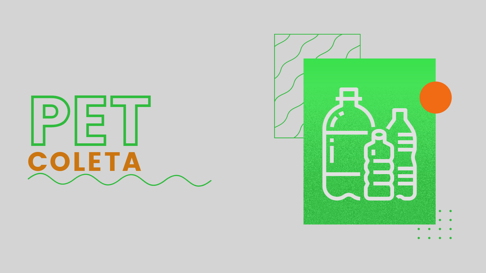

On12- Back-end{reprograma} :purple_heart: Projeto final 🚀 Status: **em construção**  :construction:

<h1 align="center">
  

 Pet-Coleta: Uma iniciativa inspirada na (ONG) Anjos do Poço - Recife PE

</h1>

  
## **Sumário**  

- [Apresentação](#apresentação)
- [Qual o objetivo?](#qual-o-objetivo?)
- [Funcionalidades](#funcionalidades)
- [Rotas](#rotas)
- [Demandas de negócio](#demandas-de-negocio)
- [Tecnologias e dependências ](#tecnologias-e-dependências)
- [Instruções para instalação e contribuições no projeto](#instruções-para-instalação-e-contribuições-no-projeto)
- [Implementações futuras](#implementações-futuras)
- [Referências](#referências)

## **Apresentação**

O "Pet- coleta"  :smiley_cat::dog: visa desenvolvimento sustentável, economia e praticidade. É o meu projeto de conclusão do bootcamp de Back-end da [{reprograma}](https://reprograma.com.br/). Essa  API  tem por objetivo agregar no organizacional de uma ONG, chamada Anjos do Poço. Para que assim, possa ampliar sua rede de apoio, entre amigos, interessados e solidários. A nossa principal bandeira é a atuação na DEFESA DOS ANIMAIS E MEIO AMBIENTE. 

## **Qual o objetivo?**

O objetivo da API é possibilitar que  pessoas de diferentes locais possam ter acesso e fazer parte dessa iniciativa. Sobretudo, pessoas em condições de vulnerabilidade, como catadores de reciclagem. Para que possam se direcionar nesses pontos de coleta e realizar a troca do seu material reciclável por ração para seu pet. 
A implementação da tecnologia nesse projeto possibilita a **ascenção** dessa iniciativa, além de abrenger a sua **utilização** por diferentes cidadãos e trazer **visibilidade** para a ONG Anjos do Poço, que conta com outras iniciativas incríveis além da coleta seletiva. 
Como: 
	-  adoção de animais;
	- consultas veterinárias gratuitas através de multirão;
	-  campanhas educativas na área do direito dos animais, entre outras. 
Como mencionado, a nossa principal abordagem é na luta em prol dos animais e meio ambiente. 

## **Funcionalidades**

  
- [X] Cadastro de usuários no ponto de coleta de sua proximidade. 
- [X] Lista de todos os pontos de coleta reciclável espalhados pela Zona norte do Recife.
- [X] Atualização de cadastro dos usuários inseridos no Projeto. 
- [X] Atualização dos respectivos pontos de coleta. 

## **Rotas**

  
Esta API está sendo executada na `porta 8080` e para que todas as rotas possam ser acessadas localmente é necessário usar `http://localhost:8080/` antes dos endpoints de requisição.

  
| **_{GET}_** | Retorna |
| ------------------- | :-------------------: |
| /coletas/todos | Lista todos os pontos de coleta existentes.|
| /coletas/:id | Lista o ponto de coleta do id requisitado. |
| /usuarios/todos/ | Lista todos os usuários cadastrados no projeto.
| /usuarios/coleta | Lista todos os usuários cadastrados naquele ponto de coleta. |

| **_{POST}_** | Retorna |
| ------------------- | :-------------------: |
| /coletas/create | Recebe um novo ponto de Coleta, adiciona ao banco e retorna o que foi criado |
| /usuarios/cadastroColeta | Recebe um novo usuário em um ponto de coleta existente |
| /adm/criar | Recebe um novo usuário administrador |
| /adm/login | Faz login do usuário cadastrado |

| **_{PATCH}_** | Retorna |
| ------------------- | :-------------------: |
| /usuarios/atualizarnome/:id | Atualiza o parâmetro nome do usuário e retorna o item atualizado |

| **_{PUT}_** | Retorna |
| ------------------- | :-------------------: |
| /coletas/atualizar/:id | Atualiza qualquer parâmetro do ponto de Coleta e retorna o item atualizado |
| /usuarios/atualizatudo/:id | Atualiza qualquer parâmetro do usuário cadastrado e retorna o item atualizado |

| **_{DELETE}_** | Retorna |
| ------------------- | :-------------------: |
| /coletas/delete/:id | Deletar um ponto de coleta (necessita autenticação) |
| /usuarios/deletar/:id | Deleta um usuário cadastrado através do seu id |

## Demandas de negócio

- Não poderá criar um ponto de coleta com o mesmo nome, devem ser nomes diferentes pois são em locais distintos;

- Somente o adm poderá criar um ponto de coleta, assim como deletar e atualizar;

- O usuário apenas visualiza os pontos de coleta;

- Para cadastrar um usuário ele deverá se vincular a um ponto de coleta existente no momento do cadastro através do id. 

## **Tecnologias e dependências**

 

<a>
<a  href="https://git-scm.com/">
<a  href="https://nodejs.org/pt-br/">
<a  href="https://www.mongodb.com/cloud/atlas">
<a  href="https://herokuapp.com/">
 
<a  href="https://www.npmjs.com/">
<a  href="https://expressjs.com/pt-br/">
<a  href="https://mongoosejs.com/">
<a  href="https://www.npmjs.com/package/dotenv-safe">
<a  href="https://www.npmjs.com/package/bcryptjs">
<a  href="https://www.npmjs.com/package/jsonwebtoken">

## **Instruções para instalação e contribuições no projeto**

Antes de tudo você deve ter o Visual Studio Code, após isso: 
- Faça um fork e clone o projeto em sua máquina: 

		 git clone: https://github.com/Kamilasilv/projeto-petColeta
- Entre na pasta do projeto:

		PROJETOFINAL
- Instale as dependências: 

		npm install 
- Consulte as modificações e testes através da rota principal e inclua os endpoints de requisição:

		https://projetofinal-petcoleta.herokuapp.com/ > Através do heroku
		http://localhost:8080/ > Localmente (npm start)
	

- Crie uma branch para realizar suas alterações:

		 git checkout -b feature/nome-da-sua-branch;

 - Realize o push das suas alterações e abra uma solicitação de  pull request.

## **Implementações futuras**
- Adicionar a API outro(s) banco(s) de dados com as demais ações realizadas na ONG anjos do poço. 
- Integrar com o front-end. 

## **Referências**

[Anjos do Poço](http://www.anjosdopoco.org/)

[Como escrever um README.md sensacional no Github](https://dev.to/reginadiana/como-escrever-um-readme-md-sensacional-no-github-4509#o-que-%C3%A9-o-readme)

[Emojis em markdown](https://gist.github.com/tgmarinho/6cf35ac45644a0b68a45069d23c2e4b6)

  

Criado  por **Kamila Silva** e o apoio de todes que fazem a reprograma acontecer. :purple_heart:
#### Entre em contato comigo por:
 

